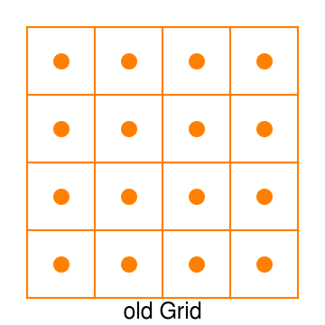
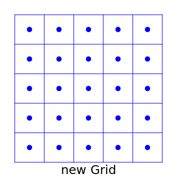
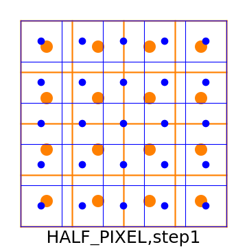
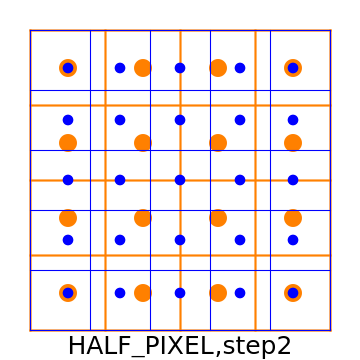
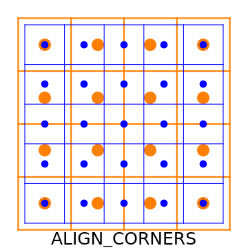
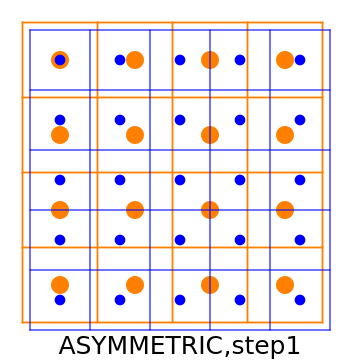
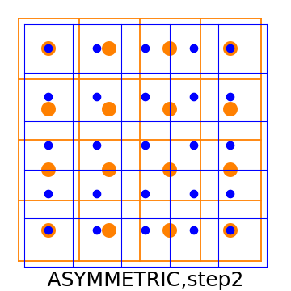

# Resize 层
+ Simple example
+ shape
+ scales
+ resize_mode
+ coordinate_transformation
+ align_corners（deprecated since TensorRT 8）
+ nearest_rounding
+ selector_for_single_pixel
+ set_input
    - 静态 set_input
    - 动态 set_input（使用 context.set_shape_input）
    - dynamic shape 模式下的 resize + set_input（使用 context.set_input_shape）
+ 关于 coordinate_transformation 的说明

---
## Simple example
+ Refer to SimpleExample.py
+ Shape of input tensor 0: (1,3,4,5)
$$
\left[\begin{matrix}
    \left[\begin{matrix}
        \left[\begin{matrix}
             0. &  1. &  2. &  3. &  4. \\
             5. &  6. &  7. &  8. &  9. \\
            10. & 11. & 12. & 13. & 14. \\
            15. & 16. & 17. & 18. & 19.
        \end{matrix}\right]
        \left[\begin{matrix}
            20. & 21. & 22. & 23. & 24. \\
            25. & 26. & 27. & 28. & 29. \\
            30. & 31. & 32. & 33. & 34. \\
            35. & 36. & 37. & 38. & 39.
        \end{matrix}\right]
        \left[\begin{matrix}
            40. & 41. & 42. & 43. & 44. \\
            45. & 46. & 47. & 48. & 49. \\
            50. & 51. & 52. & 53. & 54. \\
            55. & 56. & 57. & 58. & 59.
        \end{matrix}\right]
    \end{matrix}\right]
\end{matrix}\right]
$$

+ 没有设置任何参数, shape of output tensor 0: (1,3,4,5)，与输入张量相同
$$
\left[\begin{matrix}
    \left[\begin{matrix}
        \left[\begin{matrix}
             0. &  1. &  2. &  3. &  4. \\
             5. &  6. &  7. &  8. &  9. \\
            10. & 11. & 12. & 13. & 14. \\
            15. & 16. & 17. & 18. & 19.
        \end{matrix}\right]
        \left[\begin{matrix}
            20. & 21. & 22. & 23. & 24. \\
            25. & 26. & 27. & 28. & 29. \\
            30. & 31. & 32. & 33. & 34. \\
            35. & 36. & 37. & 38. & 39.
        \end{matrix}\right]
        \left[\begin{matrix}
            40. & 41. & 42. & 43. & 44. \\
            45. & 46. & 47. & 48. & 49. \\
            50. & 51. & 52. & 53. & 54. \\
            55. & 56. & 57. & 58. & 59.
        \end{matrix}\right]
    \end{matrix}\right]
\end{matrix}\right]
$$

---

## shape
+ Refer to Shape.py，指定输出张量的形状

+ Shape of output tensor 0: (2,3,6,10)，默认使用最近邻插值，可以在多个维度上进行
$$
\left[\begin{matrix}
    \left[\begin{matrix}
        \left[\begin{matrix}
            1. &  0. &  1. &  1. &  2. &  2. &  3. &  3. &  4. &  4. \\
            2. &  0. &  1. &  1. &  2. &  2. &  3. &  3. &  4. &  4. \\
            3. &  5. &  6. &  6. &  7. &  7. &  8. &  8. &  9. &  9. \\
            1. & 10. & 11. & 11. & 12. & 12. & 13. & 13. & 14. & 14. \\
            2. & 10. & 11. & 11. & 12. & 12. & 13. & 13. & 14. & 14. \\
            3. & 15. & 16. & 16. & 17. & 17. & 18. & 18. & 19. & 19.
        \end{matrix}\right] \\
        \left[\begin{matrix}
            1. & 20. & 21. & 21. & 22. & 22. & 23. & 23. & 24. & 24. \\
            2. & 20. & 21. & 21. & 22. & 22. & 23. & 23. & 24. & 24. \\
            3. & 25. & 26. & 26. & 27. & 27. & 28. & 28. & 29. & 29. \\
            4. & 30. & 31. & 31. & 32. & 32. & 33. & 33. & 34. & 34. \\
            5. & 30. & 31. & 31. & 32. & 32. & 33. & 33. & 34. & 34. \\
            6. & 35. & 36. & 36. & 37. & 37. & 38. & 38. & 39. & 39.
        \end{matrix}\right] \\
        \left[\begin{matrix}
            1. & 40. & 41. & 41. & 42. & 42. & 43. & 43. & 44. & 44. \\
            2. & 40. & 41. & 41. & 42. & 42. & 43. & 43. & 44. & 44. \\
            3. & 45. & 46. & 46. & 47. & 47. & 48. & 48. & 49. & 49. \\
            4. & 50. & 51. & 51. & 52. & 52. & 53. & 53. & 54. & 54. \\
            5. & 50. & 51. & 51. & 52. & 52. & 53. & 53. & 54. & 54. \\
            6. & 55. & 56. & 56. & 57. & 57. & 58. & 58. & 59. & 59.
        \end{matrix}\right]
    \end{matrix}\right] \\
    \left[\begin{matrix}
        \left[\begin{matrix}
            1. &  0. &  1. &  1. &  2. &  2. &  3. &  3. &  4. &  4. \\
            2. &  0. &  1. &  1. &  2. &  2. &  3. &  3. &  4. &  4. \\
            3. &  5. &  6. &  6. &  7. &  7. &  8. &  8. &  9. &  9. \\
            1. & 10. & 11. & 11. & 12. & 12. & 13. & 13. & 14. & 14. \\
            2. & 10. & 11. & 11. & 12. & 12. & 13. & 13. & 14. & 14. \\
            3. & 15. & 16. & 16. & 17. & 17. & 18. & 18. & 19. & 19.
        \end{matrix}\right] \\
        \left[\begin{matrix}
            1. & 20. & 21. & 21. & 22. & 22. & 23. & 23. & 24. & 24. \\
            2. & 20. & 21. & 21. & 22. & 22. & 23. & 23. & 24. & 24. \\
            3. & 25. & 26. & 26. & 27. & 27. & 28. & 28. & 29. & 29. \\
            4. & 30. & 31. & 31. & 32. & 32. & 33. & 33. & 34. & 34. \\
            5. & 30. & 31. & 31. & 32. & 32. & 33. & 33. & 34. & 34. \\
            6. & 35. & 36. & 36. & 37. & 37. & 38. & 38. & 39. & 39.
        \end{matrix}\right] \\
        \left[\begin{matrix}
            1. & 40. & 41. & 41. & 42. & 42. & 43. & 43. & 44. & 44. \\
            2. & 40. & 41. & 41. & 42. & 42. & 43. & 43. & 44. & 44. \\
            3. & 45. & 46. & 46. & 47. & 47. & 48. & 48. & 49. & 49. \\
            4. & 50. & 51. & 51. & 52. & 52. & 53. & 53. & 54. & 54. \\
            5. & 50. & 51. & 51. & 52. & 52. & 53. & 53. & 54. & 54. \\
            6. & 55. & 56. & 56. & 57. & 57. & 58. & 58. & 59. & 59.
        \end{matrix}\right]
    \end{matrix}\right]
\end{matrix}\right]
$$

---

## scales
+ Refer to Scales.py，指定输出张量的缩放比

+ Shape of output tensor 0: (2,3,6,10)，与初始范例的结果相同

---

## resize_mode
+ Refer to Resize_mode.py，指定插值算法

+ 指定 resize_mode=LINEAR, shape of output tensor 0: (1,3,6,10)
$$
\left[\begin{matrix}
    \left[\begin{matrix}
        \left[\begin{matrix}
             0.    &  0.25  &  0.75  &  1.25  &  1.75  &  2.25  & 2.75   & 3.25   & 3.75   & 4.     \\
             2.5   &  2.75  &  3.25  &  3.75  &  4.25  &  4.75  & 5.25   & 5.75   & 6.25   & 6.5    \\
             5.833 &  6.083 &  6.583 &  7.083 &  7.583 &  8.083 & 8.583  & 9.083  & 9.583  & 9.833  \\
             9.166 &  9.416 &  9.916 & 10.416 & 10.916 & 11.416 & 11.916 & 12.416 & 12.916 & 13.166 \\
            12.5   & 12.75  & 13.25  & 13.75  & 14.25  & 14.75  & 15.25  & 15.75  & 16.25  & 16.5   \\
            15.    & 15.25  & 15.75  & 16.25  & 16.75  & 17.25  & 17.75  & 18.25  & 18.75  & 19.
        \end{matrix}\right] \\
        \left[\begin{matrix}
            20.    & 20.25  & 20.75  & 21.25  & 21.75  & 22.25  & 22.75  & 23.25  & 23.75  & 24.    \\
            22.5   & 22.75  & 23.25  & 23.75  & 24.25  & 24.75  & 25.25  & 25.75  & 26.25  & 26.5   \\
            25.833 & 26.083 & 26.583 & 27.083 & 27.583 & 28.083 & 28.583 & 29.083 & 29.583 & 29.833 \\
            29.166 & 29.416 & 29.916 & 30.416 & 30.916 & 31.416 & 31.916 & 32.416 & 32.916 & 33.166 \\
            32.5   & 32.75  & 33.25  & 33.75  & 34.25  & 34.75  & 35.25  & 35.75  & 36.25  & 36.5   \\
            35.    & 35.25  & 35.75  & 36.25  & 36.75  & 37.25  & 37.75  & 38.25  & 38.75  & 39.
        \end{matrix}\right] \\
        \left[\begin{matrix}
            40.    & 40.25  & 40.75  & 41.25  & 41.75  & 42.25  & 42.75  & 43.25  & 43.75  & 44.    \\
            42.5   & 42.75  & 43.25  & 43.75  & 44.25  & 44.75  & 45.25  & 45.75  & 46.25  & 46.5   \\
            45.833 & 46.083 & 46.583 & 47.083 & 47.583 & 48.083 & 48.583 & 49.083 & 49.583 & 49.833 \\
            49.166 & 49.416 & 49.916 & 50.416 & 50.916 & 51.416 & 51.916 & 52.416 & 52.916 & 53.166 \\
            52.5   & 52.75  & 53.25  & 53.75  & 54.25  & 54.75  & 55.25  & 55.75  & 56.25  & 56.5   \\
            55.    & 55.25  & 55.75  & 56.25  & 56.75  & 57.25  & 57.75  & 58.25  & 58.75  & 59.
        \end{matrix}\right]
    \end{matrix}\right]
\end{matrix}\right]
$$

+ TensorRT<7 中默认角落对齐模式不同（见后面的说明），指定 resize_mode=LINEAR, shape of output tensor 0: (1,3,6,10)

+ 可用的插值方法
| trt.ResizeMode 名 |                             说明                              |
| :---------------: | :-----------------------------------------------------------: |
|      NEAREST      |                最邻近插值，支持 1 ~ 8 维的插值                |
|      LINEAR       | 线性插值，支持单线性（1维）、双线性（2维）、三线性插值（3维） |

---

## coordinate_transformation
+ 见 Coordinate_transformation,py，指定插值时角落对齐方式
```python
resizeLayer = network.add_resize(inputT0)
resizeLayer.shape = (nB, nCOut, nHOut, nWOut)
#resizeLayer.coordinate_transformation   = trt.ResizeCoordinateTransformation.ALIGN_CORNERS  # 指定角落对齐模式，默认值 HALF_PIXEL
```

+ 指定 coordinate_transformation=trt.ResizeCoordinateTransformation.HALF_PIXEL, shape of output tensor 0: (1,3,6,10)
$$
\left[\begin{matrix}
    \left[\begin{matrix}
        \left[\begin{matrix}
             0.    &  0.25  &  0.75  &  1.25  &  1.75  &  2.25  &  2.75  &  3.25  &  3.75  &  4.    \\
             2.5   &  2.75  &  3.25  &  3.75  &  4.25  &  4.75  &  5.25  &  5.75  &  6.25  &  6.5   \\
             5.833 &  6.083 &  6.583 &  7.083 &  7.583 &  8.083 &  8.583 &  9.083 &  9.583 &  9.833 \\
             9.167 &  9.417 &  9.917 & 10.417 & 10.917 & 11.417 & 11.917 & 12.417 & 12.917 & 13.167 \\
            12.5   & 12.75  & 13.25  & 13.75  & 14.25  & 14.75  & 15.25  & 15.75  & 16.25  & 16.5   \\
            15.    & 15.25  & 15.75  & 16.25  & 16.75  & 17.25  & 17.75  & 18.25  & 18.75  & 19.
        \end{matrix}\right] \\
        \left[\begin{matrix}
            20.    & 20.25  & 20.75  & 21.25  & 21.75  & 22.25  & 22.75  & 23.25  & 23.75  & 24.    \\
            22.5   & 22.75  & 23.25  & 23.75  & 24.25  & 24.75  & 25.25  & 25.75  & 26.25  & 26.5   \\
            25.833 & 26.083 & 26.583 & 27.083 & 27.583 & 28.083 & 28.583 & 29.083 & 29.583 & 29.833 \\
            29.167 & 29.417 & 29.917 & 30.417 & 30.917 & 31.417 & 31.917 & 32.417 & 32.917 & 33.167 \\
            32.5   & 32.75  & 33.25  & 33.75  & 34.25  & 34.75  & 35.25  & 35.75  & 36.25  & 36.5   \\
            35.    & 35.25  & 35.75  & 36.25  & 36.75  & 37.25  & 37.75  & 38.25  & 38.75  & 39.
        \end{matrix}\right] \\
        \left[\begin{matrix}
            40.    & 40.25  & 40.75  & 41.25  & 41.75  & 42.25  & 42.75  & 43.25  & 43.75  & 44.    \\
            42.5   & 42.75  & 43.25  & 43.75  & 44.25  & 44.75  & 45.25  & 45.75  & 46.25  & 46.5   \\
            45.833 & 46.083 & 46.583 & 47.083 & 47.583 & 48.083 & 48.583 & 49.083 & 49.583 & 49.833 \\
            49.167 & 49.417 & 49.917 & 50.417 & 50.917 & 51.417 & 51.917 & 52.417 & 52.917 & 53.167 \\
            52.5   & 52.75  & 53.25  & 53.75  & 54.25  & 54.75  & 55.25  & 55.75  & 56.25  & 56.5   \\
            55.    & 55.25  & 55.75  & 56.25  & 56.75  & 57.25  & 57.75  & 58.25  & 58.75  & 59.
        \end{matrix}\right]
    \end{matrix}\right]
\end{matrix}\right]
$$

+ 指定 coordinate_transformation=trt.ResizeCoordinateTransformation.ALIGN_CORNERS, shape of output tensor 0: (1,3,6,10)
$$
\left[\begin{matrix}
    \left[\begin{matrix}
        \left[\begin{matrix}
             0. &  0.444 &  0.889 &  1.333 &  1.778 &  2.222 &  2.667 &  3.111 &  3.556 &  4. \\
             3. &  3.444 &  3.889 &  4.333 &  4.778 &  5.222 &  5.667 &  6.111 &  6.556 &  7. \\
             6. &  6.444 &  6.889 &  7.333 &  7.778 &  8.222 &  8.667 &  9.111 &  9.556 & 10. \\
             9. &  9.444 &  9.889 & 10.333 & 10.778 & 11.222 & 11.667 & 12.111 & 12.556 & 13. \\
            12. & 12.444 & 12.889 & 13.333 & 13.778 & 14.222 & 14.667 & 15.111 & 15.556 & 16. \\
            15. & 15.444 & 15.889 & 16.333 & 16.778 & 17.222 & 17.667 & 18.111 & 18.556 & 19. \\
        \end{matrix}\right] \\
        \left[\begin{matrix}
            20. & 20.444 & 20.889 & 21.333 & 21.778 & 22.222 & 22.667 & 23.111 & 23.556 & 24. \\
            23. & 23.444 & 23.889 & 24.333 & 24.778 & 25.222 & 25.667 & 26.111 & 26.556 & 27. \\
            26. & 26.444 & 26.889 & 27.333 & 27.778 & 28.222 & 28.667 & 29.111 & 29.556 & 30. \\
            29. & 29.444 & 29.889 & 30.333 & 30.778 & 31.222 & 31.667 & 32.111 & 32.556 & 33. \\
            32. & 32.444 & 32.889 & 33.333 & 33.778 & 34.222 & 34.667 & 35.111 & 35.556 & 36. \\
            35. & 35.444 & 35.889 & 36.333 & 36.778 & 37.222 & 37.667 & 38.111 & 38.556 & 39. \\
        \end{matrix}\right] \\
        \left[\begin{matrix}
            40. & 40.444 & 40.889 & 41.333 & 41.778 & 42.222 & 42.667 & 43.111 & 43.556 & 44. \\
            43. & 43.444 & 43.889 & 44.333 & 44.778 & 45.222 & 45.667 & 46.111 & 46.556 & 47. \\
            46. & 46.444 & 46.889 & 47.333 & 47.778 & 48.222 & 48.667 & 49.111 & 49.556 & 50. \\
            49. & 49.444 & 49.889 & 50.333 & 50.778 & 51.222 & 51.667 & 52.111 & 52.556 & 53. \\
            52. & 52.444 & 52.889 & 53.333 & 53.778 & 54.222 & 54.667 & 55.111 & 55.556 & 56. \\
            55. & 55.444 & 55.889 & 56.333 & 56.778 & 57.222 & 57.667 & 58.111 & 58.556 & 59.
        \end{matrix}\right]
    \end{matrix}\right]
\end{matrix}\right]
$$

+ 指定 coordinate_transformation=trt.ResizeCoordinateTransformation.ASYMMETRIC, shape of output tensor 0: (1,3,6,10)
$$
\left[\begin{matrix}
    \left[\begin{matrix}
        \left[\begin{matrix}
             0.    &  0.5   &  1.    &  1.5   &  2.    &  2.5   &  3.    &  3.5   &  4.    &  4.    \\
             3.333 &  3.833 &  4.333 &  4.833 &  5.333 &  5.833 &  6.333 &  6.833 &  7.333 &  7.333 \\
             6.667 &  7.167 &  7.667 &  8.167 &  8.667 &  9.167 &  9.667 & 10.167 & 10.667 & 10.667 \\
            10.    & 10.5   & 11.    & 11.5   & 12.    & 12.5   & 13.    & 13.5   & 14.    & 14.    \\
            13.333 & 13.833 & 14.333 & 14.833 & 15.333 & 15.833 & 16.333 & 16.833 & 17.333 & 17.333 \\
            15.    & 15.5   & 16.    & 16.5   & 17.    & 17.5   & 18.    & 18.5   & 19.    & 19.
        \end{matrix}\right] \\
        \left[\begin{matrix}
            20.    & 20.5   & 21.    & 21.5   & 22.    & 22.5   & 23.    & 23.5   & 24.    & 24.    \\
            23.333 & 23.833 & 24.333 & 24.833 & 25.333 & 25.833 & 26.333 & 26.833 & 27.333 & 27.333 \\
            26.667 & 27.167 & 27.667 & 28.167 & 28.667 & 29.167 & 29.667 & 30.167 & 30.667 & 30.667 \\
            30.    & 30.5   & 31.    & 31.5   & 32.    & 32.5   & 33.    & 33.5   & 34.    & 34.    \\
            33.333 & 33.833 & 34.333 & 34.833 & 35.333 & 35.833 & 36.333 & 36.833 & 37.333 & 37.333 \\
            35.    & 35.5   & 36.    & 36.5   & 37.    & 37.5   & 38.    & 38.5   & 39.    & 39.
        \end{matrix}\right] \\
        \left[\begin{matrix}
            40.    & 40.5   & 41.    & 41.5   & 42.    & 42.5   & 43.    & 43.5   & 44.    & 44.    \\
            43.333 & 43.833 & 44.333 & 44.833 & 45.333 & 45.833 & 46.333 & 46.833 & 47.333 & 47.333 \\
            46.667 & 47.167 & 47.667 & 48.167 & 48.667 & 49.167 & 49.667 & 50.167 & 50.667 & 50.667 \\
            50.    & 50.5   & 51.    & 51.5   & 52.    & 52.5   & 53.    & 53.5   & 54.    & 54.    \\
            53.333 & 53.833 & 54.333 & 54.833 & 55.333 & 55.833 & 56.333 & 56.833 & 57.333 & 57.333 \\
            55.    & 55.5   & 56.    & 56.5   & 57.    & 57.5   & 58.    & 58.5   & 59.    & 59.
        \end{matrix}\right]
    \end{matrix}\right]
\end{matrix}\right]
$$

+ 计算过程，见后面的说明

+ 可用的插值方法
| trt.ResizeCoordinateTransformation 名 |                       说明                        |
| :-----------------------------------: | :-----------------------------------------------: |
|             ALIGN_CORNERS             |       等效于 resizeLayer.align_corners=True       |
|              ASYMMETRIC               | 等效于 TensorRT<7 resizeLayer.align_corners=False |
|              HALF_PIXEL               | 等效于 TensorRT7 resizeLayer.align_corners=False  |

---

## align_corners（deprecated since TensorRT 8）
+ Refer to Align_corners.py
+ 指定 align_corners=True, shape of output tensor 0: (1,3,6,10)，结果与 coordinate_transformation=ALIGN_CORNERS 相同

+ TensorRT7 中指定 align_corners=False, shape of output tensor 0: (1,3,6,10)，结果与 coordinate_transformation=HALF_PIXEL 相同

+ TensorRT<7 中指定 align_corners=False, shape of output tensor 0: (1,3,6,10)，结果与 coordinate_transformation=ASYMMETRIC 相同

---

## nearest_rounding
+ Refer to Nearest_rounding.py，设置最近邻插值舍入方法

+ 指定 resizeLayer.nearest_rounding = trt.ResizeRoundMode.FLOOR, shape of output tensor 0: (1,3,6,10)
$$
\left[\begin{matrix}
    \left[\begin{matrix}
        \left[\begin{matrix}
             1. &  0. &  1. &  1. &  2. &  2. &  3. &  3. &  4. &  4. \\
             2. &  0. &  1. &  1. &  2. &  2. &  3. &  3. &  4. &  4. \\
             3. &  5. &  6. &  6. &  7. &  7. &  8. &  8. &  9. &  9. \\
            1.  & 10. & 11. & 11. & 12. & 12. & 13. & 13. & 14. & 14. \\
            2.  & 10. & 11. & 11. & 12. & 12. & 13. & 13. & 14. & 14. \\
            3.  & 15. & 16. & 16. & 17. & 17. & 18. & 18. & 19. & 19.
        \end{matrix}\right] \\
        \left[\begin{matrix}
            1.  & 20. & 21. & 21. & 22. & 22. & 23. & 23. & 24. & 24. \\
            2.  & 20. & 21. & 21. & 22. & 22. & 23. & 23. & 24. & 24. \\
            3.  & 25. & 26. & 26. & 27. & 27. & 28. & 28. & 29. & 29. \\
            4.  & 30. & 31. & 31. & 32. & 32. & 33. & 33. & 34. & 34. \\
            5.  & 30. & 31. & 31. & 32. & 32. & 33. & 33. & 34. & 34. \\
            6.  & 35. & 36. & 36. & 37. & 37. & 38. & 38. & 39. & 39.
        \end{matrix}\right] \\
        \left[\begin{matrix}
            1.  & 40. & 41. & 41. & 42. & 42. & 43. & 43. & 44. & 44. \\
            2.  & 40. & 41. & 41. & 42. & 42. & 43. & 43. & 44. & 44. \\
            3.  & 45. & 46. & 46. & 47. & 47. & 48. & 48. & 49. & 49. \\
            4.  & 50. & 51. & 51. & 52. & 52. & 53. & 53. & 54. & 54. \\
            5.  & 50. & 51. & 51. & 52. & 52. & 53. & 53. & 54. & 54. \\
            6.  & 55. & 56. & 56. & 57. & 57. & 58. & 58. & 59. & 59.
        \end{matrix}\right]
    \end{matrix}\right]
\end{matrix}\right]
$$

+ 指定 resizeLayer.nearest_rounding = trt.ResizeRoundMode.CEIL, shape of output tensor 0: (1,3,6,10)
$$
\left[\begin{matrix}
    \left[\begin{matrix}
        \left[\begin{matrix}
             0. &  1. &  1. &  2. &  2. &  3. &  3. &  4. &  4. &  4. \\
             5. &  6. &  6. &  7. &  7. &  8. &  8. &  9. &  9. &  9. \\
            10. & 11. & 11. & 12. & 12. & 13. & 13. & 14. & 14. & 14. \\
            10. & 11. & 11. & 12. & 12. & 13. & 13. & 14. & 14. & 14. \\
            15. & 16. & 16. & 17. & 17. & 18. & 18. & 19. & 19. & 19. \\
            15. & 16. & 16. & 17. & 17. & 18. & 18. & 19. & 19. & 19.
        \end{matrix}\right] \\
        \left[\begin{matrix}
            20. & 21. & 21. & 22. & 22. & 23. & 23. & 24. & 24. & 24. \\
            25. & 26. & 26. & 27. & 27. & 28. & 28. & 29. & 29. & 29. \\
            30. & 31. & 31. & 32. & 32. & 33. & 33. & 34. & 34. & 34. \\
            30. & 31. & 31. & 32. & 32. & 33. & 33. & 34. & 34. & 34. \\
            35. & 36. & 36. & 37. & 37. & 38. & 38. & 39. & 39. & 39. \\
            35. & 36. & 36. & 37. & 37. & 38. & 38. & 39. & 39. & 39.
        \end{matrix}\right] \\
        \left[\begin{matrix}
            40. & 41. & 41. & 42. & 42. & 43. & 43. & 44. & 44. & 44. \\
            45. & 46. & 46. & 47. & 47. & 48. & 48. & 49. & 49. & 49. \\
            50. & 51. & 51. & 52. & 52. & 53. & 53. & 54. & 54. & 54. \\
            50. & 51. & 51. & 52. & 52. & 53. & 53. & 54. & 54. & 54. \\
            55. & 56. & 56. & 57. & 57. & 58. & 58. & 59. & 59. & 59. \\
            55. & 56. & 56. & 57. & 57. & 58. & 58. & 59. & 59. & 59.
        \end{matrix}\right]
    \end{matrix}\right]
\end{matrix}\right]
$$

+ 指定 resizeLayer.nearest_rounding = trt.ResizeRoundMode.HALF_DOWN, shape of output tensor 0: (1,3,6,10)
$$
\left[\begin{matrix}
    \left[\begin{matrix}
        \left[\begin{matrix}
             0. &  0. &  1. &  1. &  2. &  2. &  3. &  3. &  4. &  4. \\
             5. &  5. &  6. &  6. &  7. &  7. &  8. &  8. &  9. &  9. \\
             5. &  5. &  6. &  6. &  7. &  7. &  8. &  8. &  9. &  9. \\
            10. & 10. & 11. & 11. & 12. & 12. & 13. & 13. & 14. & 14. \\
            15. & 15. & 16. & 16. & 17. & 17. & 18. & 18. & 19. & 19. \\
            15. & 15. & 16. & 16. & 17. & 17. & 18. & 18. & 19. & 19.
        \end{matrix}\right] \\
        \left[\begin{matrix}
            20. & 20. & 21. & 21. & 22. & 22. & 23. & 23. & 24. & 24. \\
            25. & 25. & 26. & 26. & 27. & 27. & 28. & 28. & 29. & 29. \\
            25. & 25. & 26. & 26. & 27. & 27. & 28. & 28. & 29. & 29. \\
            30. & 30. & 31. & 31. & 32. & 32. & 33. & 33. & 34. & 34. \\
            35. & 35. & 36. & 36. & 37. & 37. & 38. & 38. & 39. & 39. \\
            35. & 35. & 36. & 36. & 37. & 37. & 38. & 38. & 39. & 39.
        \end{matrix}\right] \\
        \left[\begin{matrix}
            40. & 40. & 41. & 41. & 42. & 42. & 43. & 43. & 44. & 44. \\
            45. & 45. & 46. & 46. & 47. & 47. & 48. & 48. & 49. & 49. \\
            45. & 45. & 46. & 46. & 47. & 47. & 48. & 48. & 49. & 49. \\
            50. & 50. & 51. & 51. & 52. & 52. & 53. & 53. & 54. & 54. \\
            55. & 55. & 56. & 56. & 57. & 57. & 58. & 58. & 59. & 59. \\
            55. & 55. & 56. & 56. & 57. & 57. & 58. & 58. & 59. & 59.
        \end{matrix}\right]
    \end{matrix}\right]
\end{matrix}\right]
$$

+ 指定 resizeLayer.nearest_rounding = trt.ResizeRoundMode.CEIL, shape of output tensor 0: (1,3,6,10)
$$
\left[\begin{matrix}
    \left[\begin{matrix}
        \left[\begin{matrix}
             0. &  1. &  1. &  2. &  2. &  3. &  3. &  4. &  4. &  4. \\
             5. &  6. &  6. &  7. &  7. &  8. &  8. &  9. &  9. &  9. \\
             5. &  6. &  6. &  7. &  7. &  8. &  8. &  9. &  9. &  9. \\
            10. & 11. & 11. & 12. & 12. & 13. & 13. & 14. & 14. & 14. \\
            15. & 16. & 16. & 17. & 17. & 18. & 18. & 19. & 19. & 19. \\
            15. & 16. & 16. & 17. & 17. & 18. & 18. & 19. & 19. & 19.
        \end{matrix}\right] \\
        \left[\begin{matrix}
            20. & 21. & 21. & 22. & 22. & 23. & 23. & 24. & 24. & 24. \\
            25. & 26. & 26. & 27. & 27. & 28. & 28. & 29. & 29. & 29. \\
            25. & 26. & 26. & 27. & 27. & 28. & 28. & 29. & 29. & 29. \\
            30. & 31. & 31. & 32. & 32. & 33. & 33. & 34. & 34. & 34. \\
            35. & 36. & 36. & 37. & 37. & 38. & 38. & 39. & 39. & 39. \\
            35. & 36. & 36. & 37. & 37. & 38. & 38. & 39. & 39. & 39.
        \end{matrix}\right] \\
        \left[\begin{matrix}
            40. & 41. & 41. & 42. & 42. & 43. & 43. & 44. & 44. & 44. \\
            45. & 46. & 46. & 47. & 47. & 48. & 48. & 49. & 49. & 49. \\
            45. & 46. & 46. & 47. & 47. & 48. & 48. & 49. & 49. & 49. \\
            50. & 51. & 51. & 52. & 52. & 53. & 53. & 54. & 54. & 54. \\
            55. & 56. & 56. & 57. & 57. & 58. & 58. & 59. & 59. & 59. \\
            55. & 56. & 56. & 57. & 57. & 58. & 58. & 59. & 59. & 59.
        \end{matrix}\right]
    \end{matrix}\right]
\end{matrix}\right]
$$

---

## selector_for_single_pixel

+ Refer to Selector_for_single_pixel.py，设定单像素映射方法

+ 指定 selector_for_single_pixel=trt.ResizeSelector.UPPER, shape of output tensor 0: (1,3,1,1)，取值为每个通道上的最左上角元素
$$
\left[\begin{matrix}
    \left[\begin{matrix}
        \left[\begin{matrix}
             0.
        \end{matrix}\right] \\
        \left[\begin{matrix}
            20.
        \end{matrix}\right] \\
        \left[\begin{matrix}
            40.
        \end{matrix}\right]
    \end{matrix}\right]
\end{matrix}\right]
$$

+ 指定 selector_for_single_pixel=trt.ResizeSelector.FORMULA, shape of output tensor 0: (1,3,1,1)，取值按照插值公式计算坐标
+ 这里直到 TensorRT8.2 都有问题，结果与指定 UPPER 时相同

---

## set_input

### 静态 set_input

+ Refer to StaticResize.py，构建期指定输出张量尺寸

+ Shape of output tensor 0: (1,3,6,10)，与 shape 范例相同

### 动态 set_input（使用 context.set_shape_input）

+ Refer to DynamicREsizeWithShapeTensor.py，运行期使用 Shape Tensor 指定 Resize 层输出张量形状

+ Shape of output tensor 0: (2,3,6,10)，结果与 shape 范例相同

### dynamic shape 模式下的 resize + set_input（使用 context.set_input_shape）

+ Refer to DynamicREsizeWithShapeTensor.py，运行期使用 Execution Tensor 指定 Resize 层输出张量形状

+ 参考输出结果
+ 
```
inputH0 : (1, 3, 4, 5)
outputH0: (2, 6, 8, 10)
```

---

## 关于 coordinate_transformation 的说明

### 符号约定
+ 大写字母表示图像栅格，入如 $A_{600,800}$ 表示一张高 600 像素，宽 800 像素的栅格图
+ 描述图像栅格时使用中括号、格点二维索引，从零开始计数，索引可以很大且图像可以不是正方形。如 A[1023, 212] 表示图 A（首行为第 1 行）的第 1024 行和（首列为第 1 列）的第 213 列的格点
+ 描述图像坐标时使用小括号、归一化坐标，规定原点 O(0,0) 为 [0,0] 栅格的左上角角落（不是栅格中心），数值向下为 h 正方向 （第 1 分量），水平向右为 w 正方向 （第 2 分量），最右下栅格的右下角落（不是栅格中心）为 Z(1,1)。如 P(1/2,1/3) 表示图像中一半高度上、水平三等分偏左的那个分点
+ “栅格 [a,b] 的中心值（即原图像和新图像的栅格数值）用 v[a,b] 表示
+ “栅格 [a,b] 的中心坐标、h 坐标、w 坐标”分别用 c[a,b]，h[a,b]，w[a,b] 表示，且有 c[a,b] = (h[a,b],w[a,b])
+ 原始图像相关变量用下标 1 标示，新图像相关变量用下标 2 标示。如 $h_{1}, w_{1}, h_{2}, w_{2}$ 分别表示原图像高度、原图像宽度、新图像高度、新图像宽度
+ $i=D_{1}^{n}$ 表示 $i=1,2,...,n$，就是一个缩略写法而已
+ $\lfloor a \rfloor, \lceil a \rceil, \{a\}$ 分别表示向下取整、向上取整和取小数部分（$\{a\} = a - \lfloor a \rfloor$）

### HALF_PIXEL (TensorRT7 align_corners=False)
+ 等效于 pyTorch(align_corners=False)
+ 原始图像的**四个角落（而不是四个中心点）**与新图像的四个角落重合，以两图像左上角角落为原点建立坐标系，然后计算新图像的各栅格中心点在原图像坐标系中的坐标，并进行双线性插值
    - 原图像上 $c_{1}\left[i,j\right] = \left(\frac{1}{2h_{1}}+\frac{i}{h_{1}},\frac{1}{2w_{1}}+\frac{j}{w_{1}}\right),i=D_{0}^{h_{1}-1},j=D_{0}^{w_{1}-1}$
    - 新图像上 $c_{2}\left[i,j\right] = \left(\frac{1}{2h_{1}}+\frac{i}{h_{2}},\frac{1}{2w_{2}}+\frac{j}{w_{2}}\right),i=D_{0}^{h_{2}-1},j=D_{0}^{w_{2}-1}$
    - 即半格高度或宽度表示从原点到 (0,0) 栅格中心的偏移，相邻栅格坐标差值等于栅格宽度
    - 求新图像上栅格 [a,b] 中心值（即 $v_{2}[a,b]$,插值计算结果）时要找到原图像上的四个栅格用于插值，记用来插值的四个栅格中左上角那个栅格为 [p,q] 则有：$h_{1}[p,q] \le h_{2}[a,b] < h_{1}[p+1,q]，w_{1}[p,q] \le w_{2}[a,b] < w_{1}[p,q+1]$
    - 记 $\alpha = \frac{h_{1}}{h_{2}}\left(a+\frac{1}{2}\right)-\frac{1}{2},\beta = \frac{w_{1}}{w_{2}}\left(a+\frac{1}{2}\right)-\frac{1}{2}$，则上面两个不等式的解可以写成：$p = \lfloor \alpha \rfloor, q = \lfloor \beta \rfloor$
    - 于是插值结果写作：
$$
\begin{aligned}
v_{2}[a,b] &=
\left(\frac{h_{1}[p+1,q] - h_{2}[a,b]}{1/h_{1}}\right) \left(\frac{w_{1}[p,q+1] - w_{2}[a,b]}{1/w_{1}}\right) v_{1}[p,q] + \\
&\quad\;\left(\frac{h_{2}[a,b]   - h_{1}[p,q]}{1/h_{1}}\right) \left(\frac{w_{1}[p,q+1] - w_{2}[a,b]}{1/w_{1}}\right) v_{1}[p+1,q] + \\
&\quad\;\left(\frac{h_{1}[p+1,q] - h_{2}[a,b]}{1/h_{1}}\right) \left(\frac{w_{2}[a,b]   - w_{1}[p,q]}{1/w_{1}}\right) v_{1}[p,q+1] + \\
&\quad\;\left(\frac{h_{2}[a,b]   - h_{1}[p,q]}{1/h_{1}}\right) \left(\frac{w_{2}[a,b]   - w_{1}[p,q]}{1/w_{1}}\right) v_{1}[p+1,q+1] \\
&=
\left(1-\{\alpha\}\right)\left(1-\{\beta\}\right) v_{1}[p,q] + \{\alpha\}\left(1-\{\beta\}\right) v_{1}[p+1,q] + \\
&\quad\;\left(1-\{\alpha\}\right)\{\beta\} v_{1}[p,q+1] + \{\alpha\}\{\beta\} v_{1}[p+1,q+1]
\end{aligned}
$$

+ 注意，当做上采样（Upsampling）时，新图像的最外圈栅格中心点坐标可能位于原图像最外圈栅格中心点之外，
    - TensorRT<7.2，最外圈栅格中心不做特殊处理，依然按照公式计算（结果如下图示中的 step1 所示）
    - TensorRT>=7.2，最外圈栅格中心会单独“拉回”原图像的最外圈栅格中心构成的矩形之内（结果如下图示中的 step2 所示），此时新图像中最外圈栅格中心的间距与内部栅格中心之间的距离不相等

+ 图示
<div align="center" >


</div>
<div align="center" >


</div>

---

### ALIGN_CORNERS (TensorRT align_corners=True)
+ 等效于 pyTorch(align_corners=True)
+ 原始图像**四个角栅格的中心点**与新图像的四个角栅格中心点对齐，以新图像左上角角落为原点建立坐标系，然后计算新图像的各栅格中心点在原图像坐标系中的坐标，并进行双线性插值
    - 原图像上 $c_{1}\left[i,j\right] = \left(\frac{1}{2h_{2}}+\frac{i}{h_{2}}\cdot\frac{h_{2}-1}{h_{1}-1},\frac{1}{2w_{2}}+\frac{j}{w_{2}}\cdot\frac{w_{2}-1}{w_{1}-1}\right),i=D_{0}^{h_{1}-1},j=D_{0}^{w_{1}-1}$
    - 新图像上 $c_{2}\left[i,j\right] = \left(\frac{1}{2h_{2}}+\frac{i}{h_{2}},\frac{1}{2w_{2}}+\frac{j}{w_{2}}\right),i=D_{0}^{h_{2}-1},j=D_{0}^{w_{2}-1}$
    - 即半格偏移按新图像计算，另外由于原图像边长发生了缩放，需要多乘一个因子，可以考虑 i=0 和 i=h_{1}-1 的情况来理解
    - 计算过程与前面相同，记 $\alpha = \frac{h_{1}-1}{h_{2}-1}a,\beta = \frac{w_{1}-1}{h_{2}-1}b$，则上面两个不等式的解可以写成：$p = \lfloor \alpha \rfloor, q = \lfloor \beta \rfloor$
    - 于是插值结果依然写作：
$$
\begin{aligned}
v_{2}[a,b] &=
\left(1-\{\alpha\}\right)\left(1-\{\beta\}\right) v_{1}[p,q] + \{\alpha\}\left(1-\{\beta\}\right) v_{1}[p+1,q] + \\
&\quad\;\left(1-\{\alpha\}\right)\{\beta\} v_{1}[p,q+1] + \{\alpha\}\{\beta\} v_{1}[p+1,q+1]
\end{aligned}
$$

+ 图示
<div align="center" >



</div>

---

### ASYMMETRIC (TensorRT<7 align_corners=False)
+ 原始图像与新图像边长均归一化为 1，然后将原始图像**左上角栅格的中心点**与新图像左上角栅格的中心点对齐，不做进一步的缩放处理，以新图像左上角角落为原点建立坐标系，然后计算新图像的各栅格中心点在原图像坐标系中的坐标，并进行双线性插值
    - 原图像上 $c_{1}\left[i,j\right] = \left(\frac{1}{2h_{2}}+\frac{i}{h_{1}},\frac{1}{2w_{2}}+\frac{j}{w_{1}}\right),i=D_{0}^{h_{1}-1},j=D_{0}^{w_{1}-1}$
    - 新图像上 $c_{2}\left[i,j\right] = \left(\frac{1}{2h_{2}}+\frac{i}{h_{2}},\frac{1}{2w_{2}}+\frac{j}{w_{2}}\right),i=D_{0}^{h_{2}-1},j=D_{0}^{w_{2}-1}$
    - 即半格偏移按新图像计算，但相邻栅格距离仍然按照原图像和新图像各自的栅格数计算
    - 计算过程与前面相同，记 $\alpha = \frac{h_{1}}{h_{2}}a,\beta = \frac{w_{1}}{h_{2}}b$，则上面两个不等式的解可以写成：$p = \lfloor \alpha \rfloor, q = \lfloor \beta \rfloor$
    - 于是插值结果依然写作：
$$
\begin{aligned}
v_{2}[a,b] &=
\left(1-\{\alpha\}\right)\left(1-\{\beta\}\right) v_{1}[p,q] + \{\alpha\}\left(1-\{\beta\}\right) v_{1}[p+1,q] + \\
&\quad\;\left(1-\{\alpha\}\right)\{\beta\} v_{1}[p,q+1] + \{\alpha\}\{\beta\} v_{1}[p+1,q+1]
\end{aligned}
$$

+ 注意，当做上采样（Upsampling）时，新图像的最外圈栅格中心点坐标可能位于原图像最外圈栅格中心点之外，
    - TensorRT<7.2，最外圈栅格中心不做特殊处理，依然按照公式计算（结果如下图示中的 step1 所示）
    - TensorRT>=7.2，最外圈栅格中心会单独“拉回”原图像的最外圈栅格中心构成的矩形之内（结果如下图示中的 step2 所示），此时新图像中最外圈栅格中心的间距与内部栅格中心之间的距离不相等
    - 
+ 图示
<div align="center" >


</div>
<div align="center" >


</div>
