# Onnx GraphSurgeon

## 01-CreateModel
+ 创建模型，仅包含一个 GlobalLpPool 节点，保存为 .onnx 文件
+ 运行方法
```shell
python 01-CreateModel.py
```
+ 生成 01-CreateModel.onnx

<div align="center" >
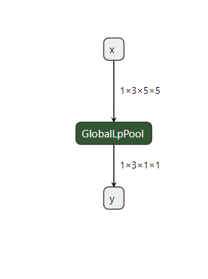
</div>

## 02-CreateModelWithInitializer
+ 创建模型，仅包含一个含权重的 Conv 节点
+ 运行方法
```shell
python 02-CreateModelWithInitializer.py
```
+ 生成 02-CreateModelWithInitializer.onnx

<div align="center" >
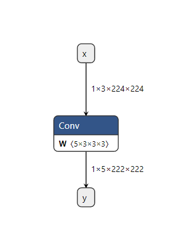
</div>

## 03-IsolateSubgraph
+ 创建模型，然后从其中切分出一个子图来作为新的模型，保存为 .onnx 文件
+ 运行方法
```shell
python 03-IsolateSubgraph.py
```
+ 产生文件 03-IsolateSubgraph_0.onnx 和 03-IsolateSubgraph_1.onnx，可以用 netron 打开

<div align="center" >
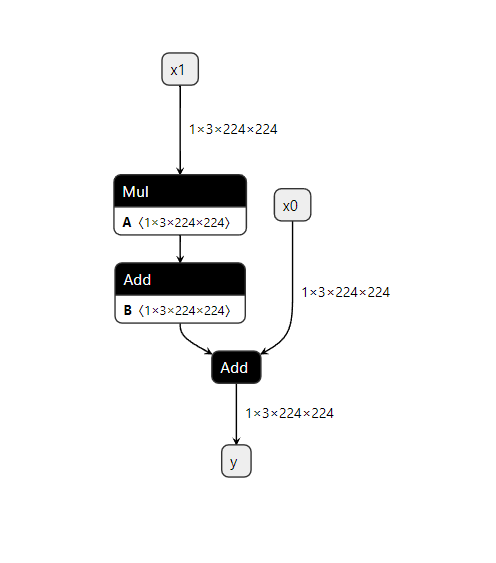
</div>
<div align="center" >
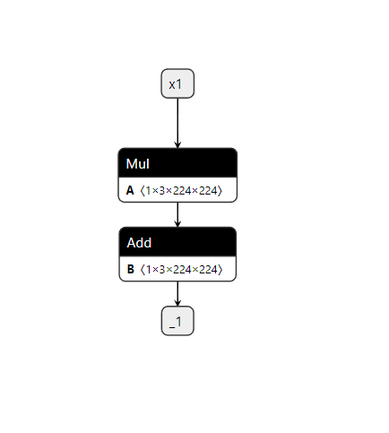
</div>

## 04-ModifyModel
+ 创建模型，然后调整一些节点
+ 运行方法
```shell
python 04-ModifyModel.py
```
+ 产生文件 04-ModifyModel_0.onnx 和 04-ModifyModel_1.onnx，可以用 netron 打开

<div align="center" >
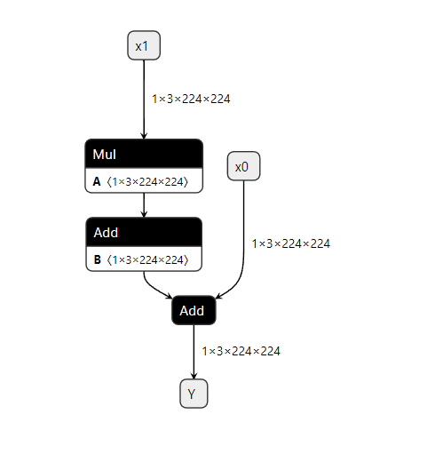
</div>
<div align="center" >
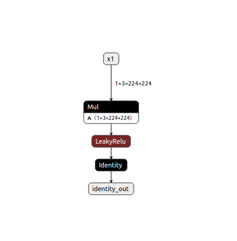
</div>

## 05-FoldModel
+ 创建模型，然后做常数折叠
+ 运行方法
```shell
python 05-FoldModel.py
```
+ 产生文件 05-FoldModel_0.onnx 和 05-FoldModel_1.onnx，可以用 netron 打开

<div align="center" >
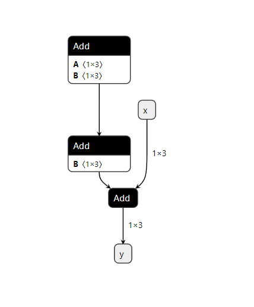
</div>
<div align="center" >

</div>

## 06-RemoveNode
+ 创建模型，然后删除一些节点
+ 运行方法
```shell
python 06-RemoveNode.py
```
+ 产生文件 06-RemoveNode_0.onnx 和 06-RemoveNode_1.onnx，可以用 netron 打开

<div align="center" >
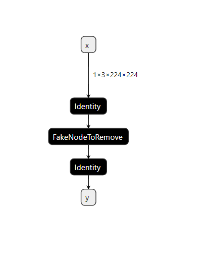
</div>
<div align="center" >
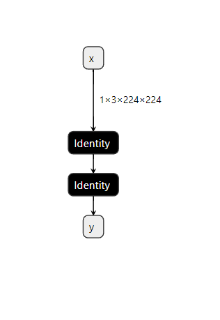
</div>

## 07-BuildModelWithAPI
+ 使用 Onnx Graphsurgeon 的 API 创建模型
+ 运行方法
```shell
python 07-BuildModelWithAPI.py
```
+ 产生文件 07-BuildModelWithAPI.onnx，可以用 netron 打开

<div align="center" >
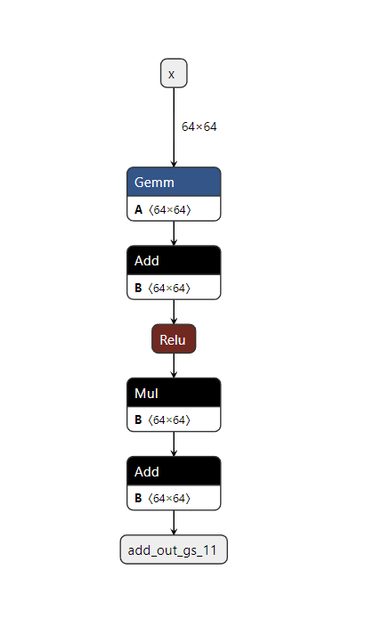
</div>

## 08-ReplaceNode
+ 创建模型，然后替换模型中的一些节点
+ 运行方法
```shell
python 08-ReplaceNode.py
```
+ 产生文件 08-ReplaceNode_0.onnx 和 08-ReplaceNode_1.onnx，可以用 netron 打开

<div align="center" >
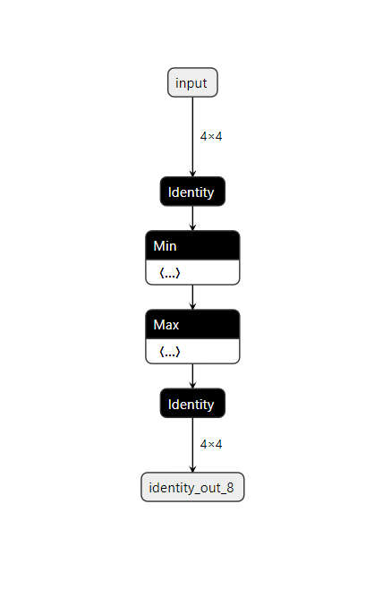
</div>
<div align="center" >

</div>

## 09-ShapeOperation
+ 创建模型，包含一些 Dynamic Shape 模式中形状相关的操作
+ 运行方法
```shell
python 09-ShapeOperation.py
```
+ 产生文件 09-ShapeOperation.onnx，可以用 netron 打开

<div align="center" >

</div>

