# TensorRT Cookbook in Chinese

## 10-BestPractice —— 有趣的 TensorRT 优化样例
+ 部分参考资料 [link](https://docs.nvidia.com/deeplearning/tensorrt/developer-guide/index.html#optimize-layer)

### AdjustReduceLayer
+ 优化 Reduce 层，通常针对输入张量的末尾维度进行规约操作效率更高
<div align="center" >
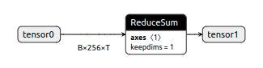
</div>
<div align="center" >

</div>
<div align="center" >
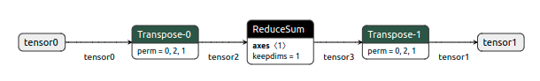
</div>
+ 环境：nvcr.io/nvidia/tensorrt:21.12-py3（包含 python 3.8.10，CUDA 11.5.50，cuDNN 8.3.1，TensoRT 8.2.3）
+ 运行方法
```shell
cd ./AdjustReduceLayer
python main.py
```
+ 参考输出结果，见 ./AdjustReduceLayer/result-A30.md
+ 示例代码一共测试了三种情形
    1. 直接 Reduce：[B,256,T] -> [B,1,T]
    2. 添加一对 Transpose：[B,256,T] -> [B,T,256] -> [B,T,1] -> [B,1,T]
    3. 在 2. 中第一个 Transpose 后面再加一个 Identity：[B,256,T] -> [B,T,256] -> [B,T,256] -> [B,T,1] -> [B,1,T]
+ 2. 中的一对 Transpose 会被 TensorRT 融合掉（变成跟 1. 一样的网络），3. 中再添加一个 Identity 破坏了这种融合，强制 Reduce 对末尾维度进行规约计算

### AlignSize
+ 优化矩阵乘法相关的层，通常数据对齐到一定的倍数上会有较好的性能
+ 环境：nvcr.io/nvidia/tensorrt:21.12-py3（包含 python 3.8.10，CUDA 11.5.50，cuDNN 8.3.1，TensoRT 8.2.3）
+ 运行方法
```shell
cd ./AlignSize
python main-script.py
```
+ 参考输出结果，见 ./AlignSize/result-A30-script.md
+ 示例代码一共测试了四种情形
    1. [32,1] -> [32,256] -> [32,2048] -> [32,256] -> [32,2048] -> ... -> [32,256]
    2. [31,1] -> [31,256] -> [31,2048] -> [31,256] -> [31,2048] -> ... -> [31,256]
    3. [32,1] -> [32,255] -> [32,2048] -> [32,255] -> [32,2048] -> ... -> [32,255]
    4. [32,1] -> [32,256] -> [32,2047] -> [32,256] -> [32,2047] -> ... -> [32,256]
+ 使用 script 时情形 1. 和 2. 性能接近，高于情形 3. 和 4. 的性能

### Convert3DMMTo2DMM
+ 优化矩阵乘法相关的层，二维矩阵参与矩阵乘能比三维矩阵参与矩阵乘获得更好的性能
<div align="center" >
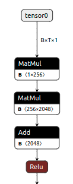

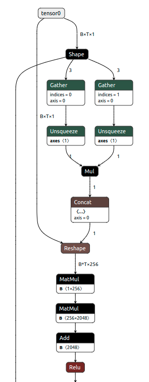
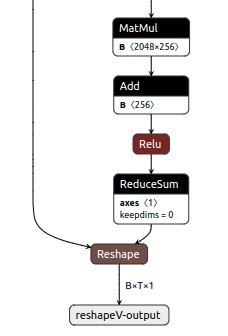
</div>
+ 环境：nvcr.io/nvidia/tensorrt:21.12-py3（包含 python 3.8.10，CUDA 11.5.50，cuDNN 8.3.1，TensoRT 8.2.3）
+ 运行方法
```shell
cd ./Convert3DMMTo2DMM
python main.py
```
+ 参考输出结果，见 ./Convert3DMMTo2DMM/result-A30.md
+ 示例代码一共测试了两种情形
    1. [32,256,1] -> [32,256,256] -> [32,256,2048] -> [32,256,256] -> [32,256,2048] -> ... -> [32,256,256] -> [32,256,1]
    2. 在 1. 的最前和最后添加两个 Reshape 节点，在最前将输入张量的前两维合并，在最后还原输出张量的前两维。
        [32,256,1] -> [32*256,256] -> [32*256,2048] -> [32*256,256] -> [32*256,2048] -> ... -> [32*256,256] -> [32,256,1]
+ 使用二维矩阵乘法的性能优于三维矩阵乘法

### ConvertTranposeMultiplicationToConvolution
+ 将 Transpose + Matrix Multiplication 转化为 Convolution + Shuffle
<div align="center" >
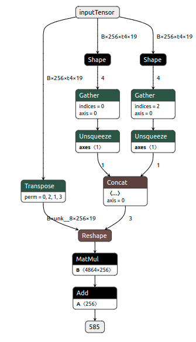

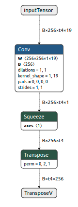
</div>
+ 环境：nvcr.io/nvidia/tensorrt:21.12-py3（包含 python 3.8.10，CUDA 11.5.50，cuDNN 8.3.1，TensoRT 8.2.3）
+ 运行方法
```shell
cd ./ConvertTranposeMultiplicationToConvolution
python main.py
```
+ 参考输出结果，见 ./ConvertTranposeMultiplicationToConvolution/result*.md
+ 示例代码测试了在 
    - 在 GTX1070 上，小 BatchSize 上就较好的加速效果
    - 在 A30 上，生成的网络结构与 GTX1070 不同，在小 BatchSize 上没有显著加速，但在加大 BatchSize 后体现出了明显加速效果
+ 使用二维矩阵乘法的性能优于三维矩阵乘法
+ 感谢 TensorRT Hackathon 2022 的 “宏伟” 同学提供思路

### EliminateSqueezeUnsqueezeTranspose
+ 手动删除一些 Squeeze/Unsqueeze/Transpose 层，以便 TensorRT 做进一步层融合
<div align="center" >
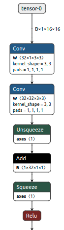
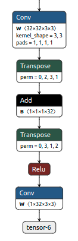


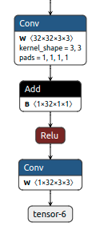
</div>
+ 环境：nvcr.io/nvidia/tensorrt:21.12-py3（包含 python 3.8.10，CUDA 11.5.50，cuDNN 8.3.1，TensoRT 8.2.3）
+ 运行方法
```shell
cd ./EliminateSqueezeUnsqueezeTranspose
python main.py
```
+ 参考输出结果，见 ./EliminateSqueezeUnsqueezeTranspose/result-A30.md
+ 示例代码一共测试了两种情形
    1. Conv -> Conv -> Unsqueeze -> Add -> Squeeze -> ReLU -> ... -> Conv -> Transpose -> Add -> Transpose -> ReLU -> ... -> Conv
    2. 去掉了 1. 中所有 Squeeze/UnsqueezeTranspose，使得所有 Conv+Add+ReLU 可以被 TensorRT 融合成一个 kernel
        Conv -> ConvAddReLU -> ... -> ConvAddReLU -> Conv
+ 优化后性能几乎翻倍

### FoldConstant
+ 手动提前计算以减少运行期计算量
<div align="center" >
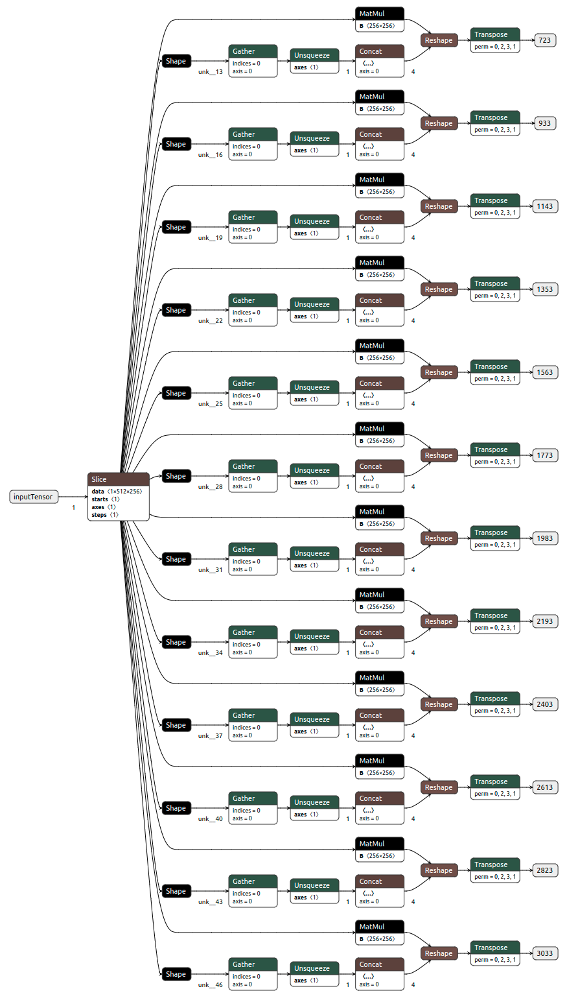

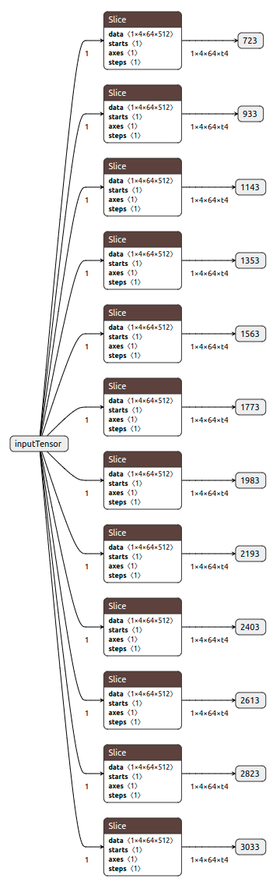
</div>
+ 示例代码模型来自 wenet [link](https://github.com/wenet-e2e/wenet)
+ 环境：nvcr.io/nvidia/tensorrt:21.12-py3（包含 python 3.8.10，CUDA 11.5.50，cuDNN 8.3.1，TensoRT 8.2.3）
+ 运行方法
```shell
cd ./FoldConstant
python main.py
```
+ 参考输出结果，见 ./FoldConstant/result-A30.md
+ 示例代码一共测试了两种情形
    1. 使用源代码算法，运行期输入张量经切片后参与 12 个矩阵乘法，然后转置
    2. 在计算图中提前完成矩阵乘法和转置，运行期输入张量用于将结果进行切片
+ 优化后性能为原来 4 倍
+ TensorRT 中使用了 shape input（因为输出张量形状依赖于输入张量的值），不同于其他样例的 dynamic shape

### IncreaseBatchSize
+ 增大推理计算的 Batch Size 来提升总体吞吐量
+ 环境：nvcr.io/nvidia/tensorrt:21.12-py3（包含 python 3.8.10，CUDA 11.5.50，cuDNN 8.3.1，TensoRT 8.2.3）
+ 运行方法
```shell
cd ./IncreaseBatchSize
python main.py
```
+ 参考输出结果，见 ./IncreaseBatchSize/result-A30.md
+ 示例代码对同一模型尝试 BatchSize = 1 ~ 1024 尺寸进行推理计算
+ 随着 Batch Size 增大，计算延迟先基本不变后逐渐增大，而吞吐量持续上升

### MultiOptimizationProfile
+ 当 dynamic shape 动态范围较大而真实输入数据比较集中时，采用多组 Optimization Profile 来优化每一部分输入数据的性能
+ 环境：nvcr.io/nvidia/tensorrt:21.12-py3（包含 python 3.8.10，CUDA 11.5.50，cuDNN 8.3.1，TensoRT 8.2.3）
+ 运行方法
```shell
cd ./MultiOptimizationProfile
python main.py
```
+ 参考输出结果，见 ./MultiOptimizationProfile/result-A30.md
+ 示例代码对同一模型尝试两种动态范围策略，第一种（model-1.plan）采用一整个 Optimization Profile，第二种（model-2.plan）采用两个分割的 Optimization Profile，分别用于大形状和小形状，然后分别测试不同输入数据形状下的性能表现
+ 采用多个 Optimization Profile 情况下整体性能表现会更好一些

