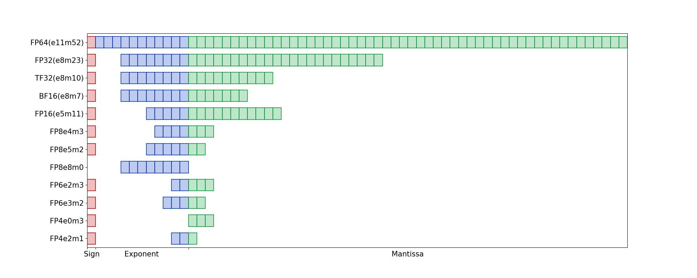

# The storage format of numbers

## Floating point number

|    Datatype    | FP64  | FP32  | TF32  | FP16  | BF16  | FP8e5m2 | FP8e4m3\* |
| :------------: | :---: | :---: | :---: | :---: | :---: | :-----: | :-------: |
|    Sign bit    |   1   |   1   |   1   |   1   |   1   |    1    |     1     |
| Exponent ($k$) |  11   |   8   |   8   |   5   |   8   |    5    |     4     |
| Mantissa ($n$) |  52   |  23   |  10   |  10   |   7   |    2    |     3     |

## Integer

|     Datatype     |                     INT64                      |                INT32                 |   INT8    |   INT4    |
| :--------------: | :--------------------------------------------: | :----------------------------------: | :-------: | :-------: |
|     Maximum      |                   $2^{63}-1$                   |              $2^{31}-1$              | $2^{7}-1$ | $2^{3}-1$ |
| value of maximum | $9223372036854775807\approx9.223\times10^{18}$ | $2147483647\approx2.147\times10^{9}$ |  $32767$  |    $7$    |

|     Datatype     |                     UINT64                      |                UINT32                |   UINT8   |   UINT4   |
| :--------------: | :---------------------------------------------: | :----------------------------------: | :-------: | :-------: |
|     Maximum      |                   $2^{64}-1$                    |              $2^{32}-1$              | $2^{8}-1$ | $2^{4}-1$ |
| value of maximum | $18446744073709551615\approx1.845\times10^{19}$ | $4294967295\approx4.295\times10^{9}$ |  $65535$  |   $15$    |
